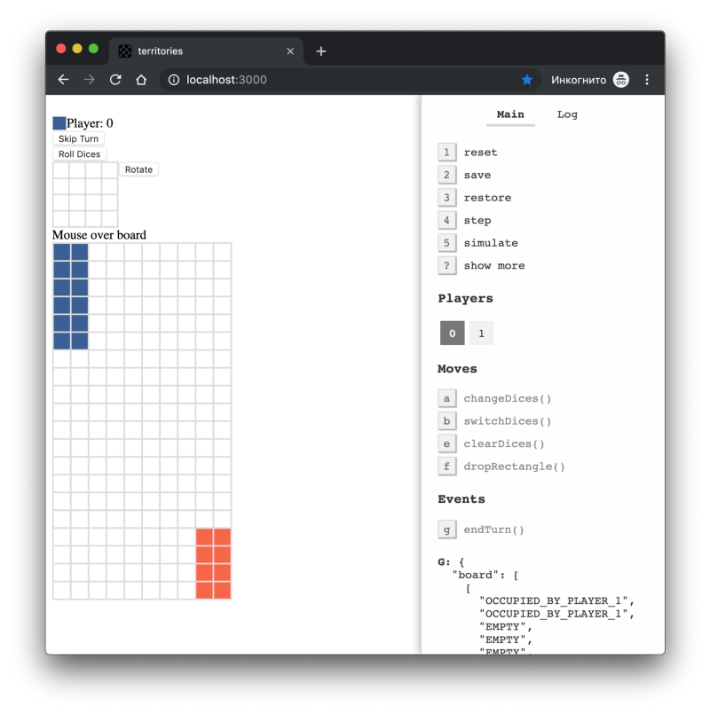
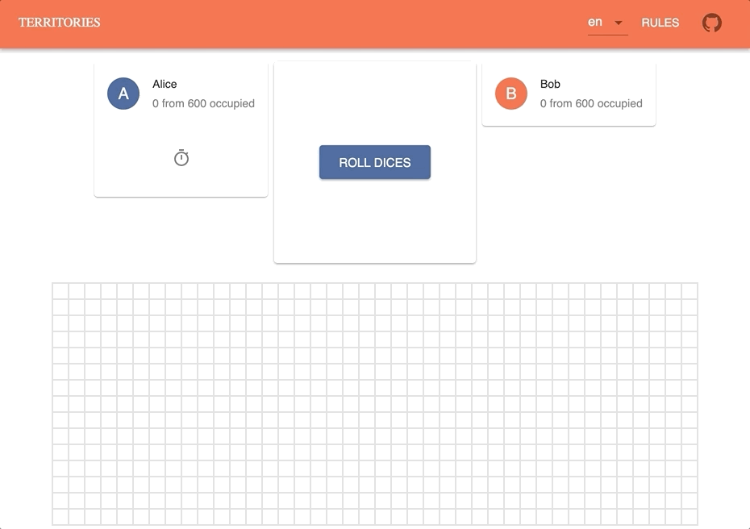
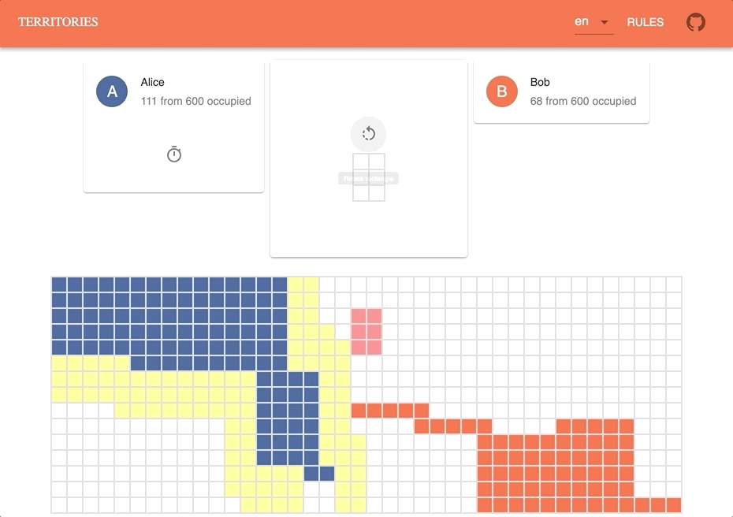
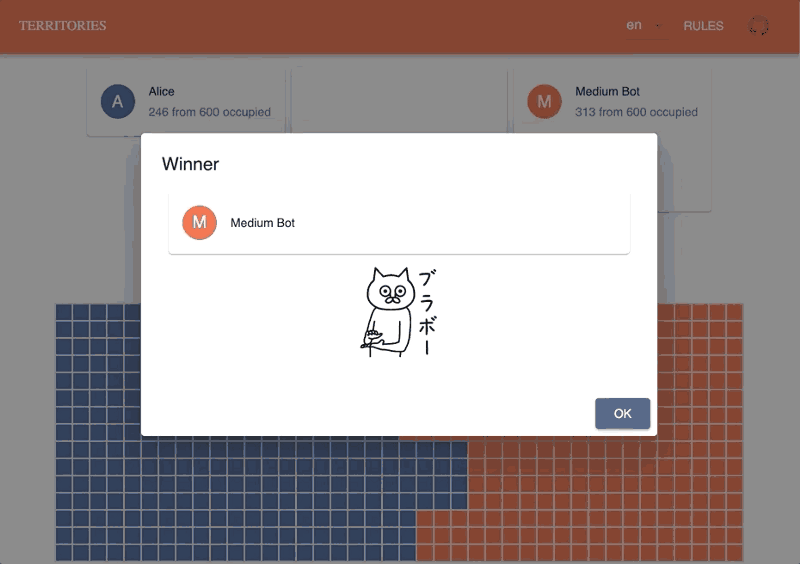

#### Какие сложности при создании первой настольной игры на JavaScript (интерфейс, мультиплеер, бот)

](./asset-1.png)

_Статья может быть интересна разработчикам, у которых есть опыт с JavaScript и React, но нет опыта в разработке игр._

Идея написать игру у меня уже давно возникла, но вот какую — идеи не было. И вот однажды мой друг скинул мне пост на Пикабу с [**_правилами игры_**](https://pikabu.ru/story/prikolnaya_miniigra_stoit_poprobovat_6269129). Что-то меня в ней зацепило. Наверное, простота и желание похвастаться своей игрой. И вот хвастаюсь — решил я запилить [_свою игру_](https://lehasvv2009.github.io/territories/).

> Вкратце (а может и не вкратце), суть игры следующая. Есть большая доска (15\*40 ячеек) с кучей пустых ячеек, 2 игрока и 2 кубика. Игрок бросает 2 кубика. Значения, которые выпали на кубиках (например, 3 и 4) являются длиной и шириной прямоугольника игрока. Игрок должен поставить этот прямоугольник на доску так, чтобы хотя бы одна его сторона соприкасалась с его ранее поставленными прямоугольниками. Если некуда поставить — пропускает ход. И так по очереди. Самые первые прямоугольники игроков ставятся в противоположные углы доски. Выигрывает тот, кто занял больше половины ячеек доски своими прямоугольниками.


Благодаря случайной фразе супруги о том, что было бы круто еще и иметь онлайн-версию, я нашел одну прекрасную библиотеку— [**_boardgame.io_**](https://boardgame.io), чуть-чуть [связанной с _Google_](https://github.com/nicolodavis/boardgame.io/blob/master/CONTRIBUTING.md#contributor-license-agreement), которая помогает неопытным разработчикам игр создавать простые пошаговые игры. Так что отчасти данная статья — это описание этой библиотеки.

](./asset-3.png)

Библиотека описывает набор правил, общих для всех пошаговых игр — **_ходы_**_,_ **_события_**_,_ **_случайность_** и т.д., а также умело хранит **_состояние_**, под капотом используя [_Redux_](https://redux.js.org/). Она также помогает реализовать серверную часть для игр **_онлайн_**. И еще есть раздел создания **_ботов_**. Жаль, что многое в ней еще не реализовано или не дореализовано.

Немного поигравшись с библиотекой, и реализовав крестики-нолики с ботом [_по руководству_](https://boardgame.io/#/tutorial) и онлайн крестики-нолики [_по другому руководству_](https://boardgame.io/#/multiplayer), я начал пробовать реализовать свою игру. Дизайн приложения был только в голове и немного на листике, так что моя первая относительно рабочая попытка выглядела как-то так:



Самое главное на этом этапе, что нужно было сделать — это описать логику, нарисовать интерфейс и связать их. В итоге оказалось, что для логики игры самое важное — это объект **_Game_**, который был описан примерно следующим образом:

```
import { Game } from "boardgame.io/core";

const Territories = Game({
  name: "territories",

  // Инициализация первичного состояния игры
  // (доска с пустыми ячейками, кубики без значений)
  setup: () => ({
    board: [...Array(15).fill([...Array(40).fill('EMPTY')])],
    dices: null,
    ...
  }),

  // Возможные действия с состоянием игроки (как actions в redux)
  moves: {

    // Бросок костей (2 кубика D6)
    rollDices: (G, ctx) => ({ 
      ...G,
      dices: ctx.random.D6(2)
    }),

    // Поставить прямоугольник на доску
    dropRectangle: (
      G,
      ctx,
      rowIndex,
      columnIndex,
      rectangleHeight,
      rectangleWidth
    ) => {
      // Сложная функция пересчета состояния ячеек доски
      // После того, как игрок поставил свой прямоугольник на доску
      return { ...G, board: G.board.map(row => ...) }
    },
  },

  flow: {
    // Заканчивать игру, когда один из игроков занял половину доски
    endGameIf: (G, ctx) => {
      ...
    },
  }

});
```

Объект **_Game_** состоит из начального состояния игры, из действий, изменяющих это состояние, и из проверки завершения игры (вызывается каждый раз при любом действии). Состояние приложения состоит из двух главных объектов — **_G_** и **_ctx_**. **_G_** — это состояние игры, описанное разработчиком, относящееся к особенностям игры (например, доска и кубики в моей игре). **_ctx_** — это общие для всех пошаговых игр сущности (например, текущий игрок **_ctx.currentPlayer_** или счетчик хода **_ctx.turn_**).

Главный класс интерфейса выглядел следующим образом:

```
class UI extends React.Component {

  handleRollDices = () => {
    this.props.moves.rollDices();
  }

  handleDropRectangle = ({
    rowIndex,
    columnIndex,
    rectangleHeight,
    rectangleWidth
  }) => {
    this.props.moves.dropRectangle(
      rowIndex,
      columnIndex,
      rectangleHeight,
      rectangleWidth
    );
    this.handleEndTurn();
  }

  handleEndTurn = () => {
    this.props.events.endTurn();
  }

  render() {
    const {
      G: { board, dices },
      ctx: { currentPlayer, gameover }
    } = this.props;

    return (
      <React.Fragment>
        <PlayersControls
          dices={dices}
          currentPlayer={currentPlayer}
          onRollDices={this.handleRollDices}
          onSkipTurn={this.handleEndTurn}
        />
        <Board
          rows={board}
          onDropRectangle={this.handleDropRectangle}
        />
        <Congratulations
          gameover={gameover}
        />
      </React.Fragment>
    );
  }
}
```

Из интерфейса можно вызывать действия **_this.props.moves_**, которые описаны в объекте _Game_ и изменяют состояние **_G_**_._ Можно также вызывать события **_this.props.events_** — это те же действия, только изменяющие состояние **_ctx_** (одинаковая для всех игр модель состояния).

Чтобы связать интерфейс _UI_ и состояние _Game_, нужно написать что-то похожее:

```
import { Client } from "boardgame.io/react";
import Game from "./Game";
import UI from "./UI"

const Territories = Client({
  game: Game,
  board: UI,
  debug: false
});

export default Territories;
```

Но, хватит про библиотеку (пусть, она еще не раз будет встречаться). В целом, реализацию игры можно разбить на **_3 последовательных этапа_**:

-   Реализация **_логики игры_** и **_пользовательского интерфейса_** (игра один на один оффлайн)
-   Реализация **_мультиплеера_** (игра один на один онлайн)
-   Реализация **_бота_** (игра против искусственного интеллекта)

Далее будут расписаны основные сложности, которые встречались на моем пути.

### Сложности при реализации пользовательского интерфейса

#### Drag-and-Drop vs Mouse-Enter


При первом дизайне казалось, что воспользоваться **_drag-and-drop_** для перемещения прямоугольника на доску — это отличная идея. Поэтому я решил попробовать популярную библиотеку [**_react-dnd_**](https://github.com/react-dnd/react-dnd). Оказалось, что подход, используемый в библиотеке, не так уж и прост в случае, когда цель дропа — это изменяющийся набор ячеек. Так что я потратил неделю на его реализацию (с параллельными попытками использования [других](https://github.com/mzabriskie/react-draggable) [_drag-and-drop_](https://github.com/react-dropzone/react-dropzone) библиотек). Однако после реализации перетаскивание прямоугольника визуально тормозило приложение. Я решил попробовать реализовать тот же перенос прямоугольника через простой **_mouse-enter + click_**, и сделал это за полдня без проблем с производительностью. Выглядело даже очевиднее (ну, кроме мобилки, там **_touch-move_** помог). На нем и остановился.

**Вывод**. Для перетаскивания компонентов в другие компоненты есть 2 подхода — **_drag-and-drop_** и **_mouse-enter + click_**. Если он простой и захотите воспользоваться **_react-dnd_** — все получится. Если сложный — стоит рассмотреть **_mouse-enter_** подход, как более простой в реализации.

#### Игральные кости



Какая настольная игра без игральных костей?! (Ticket to ride, Saboteur, да куча). В этой игре они нужны. И, мне очень понравился дизайн игры [_http://monopoly-club.org_](http://monopoly-club.org/), так что я начал искать красивые кости, как у них. Оказывается, не так уж и просто найти красивые, готовые и бесплатные 3d-модели для веб! Сначала я просто воспользовался [_этим проектом_](https://github.com/AdamTyler/react-dice-complete), так как там было достаточно функциональности для логики. Но, красота требует жертв. Так что, через недели полторы скитаний по просторам интернета и неудачных попыток готовых решений я нашел прекрасную реализацию красивых 3d кубиков— [**_http://www.teall.info/2014/01/online-3d-dice-roller.html_**](http://www.teall.info/2014/01/online-3d-dice-roller.html). После этого немного изучений [**_three.js_**](https://threejs.org/), немного настроек — и кубики _3_ и _6_ отлично катятся в 3d на **_WebGL_** со следующим кодом:

```
<Dices3d
  dices={[{
    type: "d6",
    backColor: "red",
    fontColor: "white",
    value: 3
  }, {
    type: "d6",
    backColor: "blue",
    fontColor: "white",
    value: 6
  }]}
/>
```

**Вывод.** Довольно непросто найти готовые, красивые и бесплатные 3d модели для специфичных компонентов. Так что или учите [**_three.js_**](https://threejs.org/) (или аналоги, как [**_babylon.js_**](https://www.babylonjs.com/)), или рассчитывайте на небыстрое и негарантированное нахождение готового.

### Сложности при реализации логики игры

#### Производительность при подсчете победы


Игра должна заканчиваться, когда один из игроков занял больше, чем половину доски. Фреймворк _boardgame.io_ в конце каждого хода вызывает метод **_endGameIf_**. И, если метод что-то возвращает, то игра заканчивается. Первой реализацией этого метода было прохождение по всей доске, которое считает количество занятых игроком ячеек и сравнивает его с половиной числа всех ячеек. В итоге, визуально казалось, что в конце хода игра немного тормозит. Поэтому было решено добавить в объект состояния _G_ счетчики для каждого игрока `G.occupiedCells.PLAYER_1 = 0`. Эти счетчики увеличивались, как только игрок ставил прямоугольник на доску. Это сделало функцию победы быстрее, так как оставалось только сравнивать счетчики с половиной числа всех ячеек. Однако, когда были какие-то нововведения в игру (например, автоматический захват территорий, уже не доступных для другого игрока), нужно было не забывать обновлять эти счетчики.

**Вывод.** Если производительность функции победы плохо влияет на приложение, можно считать важные для победы параметры в ходе игры и сохранять их в состоянии, как **_кэш_**. Но, после внедрения их нужно не забывать про их существование и инвалидацию, особенно если появляется новая функциональность.

#### Алгоритм нахождения всех ячеек для автозаполнения



Когда игра была в какой-то мере реализована и были сыграны несколько тестовых игр, было замечено, что в процессе игры появляются ячейки, которые могут быть захвачены только одним игроком. Например, ячейки, которые с трех сторон окружены ячейками первого игрока, а с четвертой — границей доски. В итоге первый игрок очень долго выкидывал кости, чтобы рано или поздно занять эти ячейки. Игра сильно растягивалась и пропадал интерес в ее играть.

Поэтому было решено отдавать ячейки игроку, если только он может ими завладеть. Такие ячейки могли появляться только когда игрок ставит прямоугольник. Однако как в двумерном массиве (доска — это двумерный массив) найти множество ячеек, которые замкнуты в контуре первого игрока или границы? Решение пришло не сразу. В основном я пытался искать статьи, которые описывают решения задач поиска замкнутого контура. Например, [_вот эта_](https://habr.com/ru/post/305002/) или [_вот эта_](http://e-maxx.ru/algo/finding_cycle).

В итоге, после тщетных попыток быстро понять, в чем смысл сложных алгоритмов, я пришел к рекурсивной реализации заливки в **_Paint (_**[**_flood-fill_**](https://en.wikipedia.org/wiki/Flood_fill)**_)_**. Алгоритм просто рекурсивно проходит по всем соседям ячейки и закрашивает до тех пор, пока не дойдет до граничной. Как всегда, есть даже готовые библиотеки в _npm_. Довольно быстро я реализовал алгоритм, который рекурсивно проходит по всем свободным ячейкам в стиле заливки (на самом деле, в стиле поиска в глубину), собирая ячейки в контур и информацию о том, кто соседи контура. Если соседи — первый игрок и граница, то эти ячейки можно отдавать первому игроку. Если второй игрок и граница — то второму. Если первый и второй игрок — то никому. Алгоритм считается очень простым и далеко не оптимизированным, но отлично справился с задачей, не имея визуальных проблем с производительностью.

**Вывод.** Не стоит бояться использовать **_простые алгоритмы_**, если их можно быстро реализовать. Возможно этого будет достаточно для решения задачи. И сэкономит кучу времени.

### Сложности при реализации мультиплеера

#### Развертывание

Фреймворк _boardgame.io_ предоставляет довольно широкие возможности мультиплеера. Например, [**_сервер_**](https://boardgame.io/#/api/Server), который [_хранит информацию_](https://boardgame.io/#/storage) про игры, [_работает с пользователями_](https://boardgame.io/#/multiplayer) и предоставляет [_API для комнат_](https://boardgame.io/#/api/API) и для игры онлайн, а также [**_клиент_**](https://boardgame.io/#/api/Client), который общается с сервером при помощи **_http_** или **_websocket_**. В ней все еще не хватает множества фич (хорошей аутентификации, удаления комнат и т.д.), но для простых игр достаточно. Например, так выглядит код для запуска сервера игры:

```
import { Server } from "boardgame.io/server";
import Game from "../Game";

const port = process.env.PORT || 8000;
const server = Server({ games: [Game] });

server.run(port, () => {
  console.log("App is running on port " + port);
});
```

Для развертывания были выбраны [**_heroku_**](https://www.heroku.com/) для сервера, [**_github-pages_**](https://pages.github.com/) для клиента и [**_travis_**](https://travis-ci.org/) в качестве _Continuous integration_ и _Continuous deployment_. Причина? Все бесплатно, не требует особой поддержки и легко интегрируется с [**_github_**](https://github.com/).

```
...
deploy:
  provider: heroku
  app: territories-backend
  skip_cleanup: true
  api_key:
    secure: ...
```

Изначально все проекты (клиент и сервер) находились в одном репозитории. Однако, из-за того, что [_travis heroku provider_](https://docs.travis-ci.com/user/deployment/heroku/) не имел поддержки работы с подпапками, были выделены отдельные _github_ репозитории для клиента и сервера. Что привело к еще нескольким концептуально правильным сложностям. Например, чтобы не дублировать код, я создал еще один репозиторий _territories-core_, в котором находились общие для клиента и сервера функции — много функций логики игры и объект _Game_.

```
territories
| - core
| - frontend
| - backend
```

Репозиторий _territories-core_ подключался, как модуль из _github_, на сервер _territories-backend_ и на клиент _territories-frontend_. Однако я бы все-таки рекомендовал публиковать модуль через `npm publish` в [_npmjs.com_](https://www.npmjs.com/), чем использовать `npm install github.com/user/repo`, так как появляются сложности со сборкой во время установки, с форматом версий и др.

```
{
  "name": "territories-backend",
  ...
  "dependencies": {
    ...
    "territories-core": "lehaSVV2009/territories-core#abdf08d"
  }
}
```

Подход с выделением отдельного репозитория для общих функций оказался красивым, но не всегда удобным для разработки, поэтому первое время я просто копировал код логики на клиент и сервер.

И тут настало время думать, что все пойдет хорошо. А нет! Оказалось, что сервер для _boardgame.io_ запускал _HTTP API_ на порту `8080`, а _Websocket API_ на порту `8081`, поэтому, когда сервер был успешно закинут на _heroku_, он падал с ошибкой, что только один _API_ с одним портом может быть запущен. Изначально я ставил на то, что это проблема _heroku_, и что стоит использовать что-то более функциональное и недорогое ([_AWS EC2_](https://aws.amazon.com/ec2/pricing/)_,_ [_Google Cloud Platform_](https://cloud.google.com/free/)_,_ [_Openshift_](https://www.openshift.com/trial/)_,_ [_Digital Ocean_](https://www.digitalocean.com/pricing/)_,_ [_Azure_](https://azure.microsoft.com/en-us/free/)_,_ и т.д.). Однако, со временем я заметил, что многим людям не нравилось 2 порта, так как было открыто около пяти _issues,_ поэтому за несколько дней изучения проекта и реализации фичи [_“один порт для http и websocket”_](https://github.com/nicolodavis/boardgame.io/pull/343/), это было исправлено и новая версия сервера нормально работала на _heroku_.

**Вывод.** У фреймворка _boardgame.io_ есть неплохая [**_поддержка мультиплеера_**](https://boardgame.io/#/multiplayer) в виде клиента и сервера, общающихся по _http_ и _websocket_. Для простоты развертывания, например, на [**_heroku_**](https://heroku.com) или [**_github-pages_**](https://pages.github.com/), можно создать отдельные репозитории для клиента и сервера. Тогда будет проще настраивать [_CI_](https://en.wikipedia.org/wiki/Continuous_integration) и [_CD_](https://en.wikipedia.org/wiki/Continuous_deployment). Чтобы не дублировать код, который одинаковый для клиента и сервера, стоит вынести общую логику в отдельную модуль/репозиторий. Для небольших нагрузок все можно сделать бесплатно.

#### Комнаты


Обычно, наличие мультиплеера предполагает возможность каким-нибудь образом подключиться к игре. Есть разные способы. Например, в [_agar.io_](https://agar.io/) все, что нужно, это ввести имя и нажать на кнопку “играть”, чтобы игра автоматически тебя подключила к какой-либо из комнат с множеством других игроков. В игре [_haxball.com_](https://www.haxball.com) игрок после ввода имени переходит на страницу с множеством комнат, в которые можно присоединиться, откуда можно выйти и где можно создавать свои комнаты. Так что, сначала стоит выбрать, какой способ больше подходит для игры.

И тут тоже на помощь может прийти _boardgame.io_. В документации об этом ни слова я не нашел, однако, если скачать их репозиторий и локально запустить `npm install && npm start`, то по [_http://localhost:3000_](http://localhost:3000/#/lobby/main) можно увидеть несколько интересных примеров, в том числе пример комнат ([_Lobby_](https://github.com/nicolodavis/boardgame.io/blob/master/examples/react-web/src/lobby/lobby.js)). Он тоже еще в [_процессе разработки_](https://github.com/nicolodavis/boardgame.io/issues/354), но многое уже готово. Тем более, что с недавних пор весь интерфейс можно полностью переопределять при помощи поля `renderer`.

```
import { Lobby } from "boardgame.io/react";

import Game from "../Game";
import UI from "../UI";

<Lobby
  gameServer="http://localhost:8080"
  lobbyServer="http://localhost:8080"
  gameComponents={[{
    game: Game,
    board: UI,
    loading: () => <div>Custom Loading...</div>,
  }]}
  renderer={({
    errorMsg,
    gameComponents,
    gameInstances,
    phase,
    playerName,
    runningGame,
    handleEnterLobby,
    handleExitLobby,
    handleCreateRoom,
    handleJoinRoom,
    handleLeaveRoom,
    handleExitRoom,
    handleRefreshRooms,
    handleStartGame
  }) => {
    if (phase === "enter") {
      return <button onClick={handleEnterLobby}>Login</button>;
    }

    if (phase === "list") {
      return (
        <div>
          {gameInstances.map(game => (
            <div key={game.gameID}>
              {game.players.map(player => player.name)}
            </div>
          )}
          <button onClick={handleCreateRoom} />
        </div>
      );
    }

    if (phase === "play") {
      return (
        <runningGame.app
          gameID={runningGame.gameID}
          playerID={runningGame.playerID}
          credentials={runningGame.credentials}
        />
      );
    }

    return "Unknown phase";
  }}
/>
```

В данный момент _Lobby_ при входе сохраняет имя пользователя в _cookies_ и использует [_boardgame.io API_](https://boardgame.io/#/api/API) для управления комнатами. При входе в комнату он рендерит компонент `Client`, который, в свою очередь, подключается по _WebSocket_ к серверу, отправляя ему название игры, идентификатор игры и индекс игрока. Как уже говорилось ранее, многое еще не реализовано или реализовано необычно (выход из игры, удаление комнаты, аутентификация, имена игроков), но достаточно для простых собственных проектов.

А вот еще несколько сложностей, связанных с реализацией мультиплеера после простой игры один на один:

-   Состояние конца игры не приходило с сервера для победителя, поэтому пришлось реализовать его самому. Все еще есть баги..
-   Бросок кубика не отображался у других игроков, так как с сервера приходило лишь новое состояние кубиков и все. Поэтому пришлось разбивать бросание кубиков на “начать бросок” и “закончить бросок”, чтобы при начале броска всем другим игрокам приходили данные о том, что бросок начался и чтобы у них отображались крутящиеся 3d кубики.
-   Блокировка кнопок для неактивного игрока. Если сейчас ход второго игрока, то первый игрок не может ничего делать, кроме как наблюдать. Так что пришлось блокировать кнопки для пользователей, когда был не их ход.
-   Большое отличие интерфейса онлайн игры от интерфейса простой игры. Например, наличие кнопок “выйти из игры”, “выйти из комнаты”, обновление имен с сервера, блокировка кнопок для неактивного игрока и т.д. В компоненте оказалось слишком много `if (multiplayer)` кода. Я думаю, что стоило бы рассмотреть вариант создания отдельного _layout_ компонента только для мультиплеера.

**Вывод.** И снова у фреймворка _boardgame.io_ есть что-то неплохое, но недоделанное для онлайн комнат, а именно [**_API_**](https://boardgame.io/#/api/API) и [**_Lobby_**](https://github.com/nicolodavis/boardgame.io/blob/master/examples/react-web/src/lobby/lobby.js). Для реализации простых игр и изучения логики комнат вполне достаточен, но для сложных проектов лучше создавать что-то свое или использовать готовое [_другое_](https://github.com/flackr/lobby/wiki/API). Также скорее всего при реализации мультиплеера придется немного переделать состояние приложения и его интерфейс.

### Сложности при реализации бота

#### Бот на основе нейронной сети

В документации фреймворка _boardgame.io_ есть [**_запись про добавление AI_**](https://boardgame.io/#/tutorial?id=adding-ai). Фреймворк реализует [**_MCTS_**](https://www.baeldung.com/java-monte-carlo-tree-search) алгоритм и предоставляет функцию для реализации, которая, на сколько я заметил, будет вызываться 1000 раз перед каждым ходом бота, чтобы понять, какой ход лучше сделать.

```
// https://boardgame.io/#/tutorial?id=adding-ai
{
  enumerate: (G, ctx) => {
    const moves = [];
    for (let i = 0; i < 9; i++) {
      if (G.cells[i] === null) {
        moves.push({ move: 'clickCell', args: [i] });
      }
    }
    return moves;
  }
}
```

Однако, во-первых, поддержка искусственного интеллекта на данный момент еще в [_процессе разработки_](https://github.com/nicolodavis/boardgame.io/issues/7), во-вторых, пока что фреймворк позволяет работать только с одним типом ходов (например, поставить крестик в случайную ячейку в крестики-нолики). В моей игре несколько типов ходов (бросить кубики, повернуть прямоугольник, поставить прямоугольник), поэтому, после нескольких неудачных попыток использовать готовый функционал, я начал изучать то, как можно реализовать своего бота.

И тут столько всего можно изучать! Нейронные сети, генетические алгоритмы, сложные собственные алгоритмы и т.д. Я остановился на нейронных сетях, так как всегда хотел попробовать их на реальном примере.

Что такое **_нейронная сеть_**? На самом деле, это просто функция, которая принимает несколько чисел и, в зависимости от типа сети, весов и слоев, возвращает какие-то значения. Например, примерно так может выглядеть самая простая линейная однослойная нейронная сеть с весами _0.12_ и _0.45_:

```
(arg1, arg2) => arg1 * 0.12 + arg2 * 0.45
```

Есть очень много разных видов и категорий нейронных сетей. Наверное, самое популярная библиотека для работы с ними — это [**_TensorFlow_**](https://www.tensorflow.org/) (она написана на _Python_, как и большая часть библиотек для искусственного интеллекта, но есть [**_Tensorflow.js_**](https://www.tensorflow.org/js)). Немного поигравшись с ней, я понял, что мне это было рано. Поэтому, в очередной из десятков статей про лучшие библиотеки для нейронных сетей я нашел [**_brain.js_**](https://github.com/BrainJS/brain.js)_._ Библиотека предоставляет множество простых методов для создания нейронных сетей, а также трансформацию нейронной сети в простую функцию на JS.

Например, моя нейронная сеть создавалась примерно следующим образом:

```
import brain from "brain.js"
import myTrainingData from "./trainingData"

// Создание нейронной сети
const net = new brain.NeuralNetwork()

// Тренировка весов для нейронной сети
net.train(myTrainingData)

// Запуск нейронной сети для расчета вероятности правильности хода
// Вернет, например, число 0.87
const probability = net.run(...).chosenByWife;
```

Есть несколько способов тренировки нейронной сети. Я использовал скучный и рабочий способ — **_тренировку с учителем_** (моей супругой), т.е. каждый раз, когда я проигрывал своей жене, все ее возможные ходы и те из них, которые она выбирала, записывались в формате _JSON_ для последующей тренировки сети:

```
[
  {
    "input": {
      "turn": 0.0001,
      "columnIndex": 0.875,
      "rowIndex": 0.7333333333333333,
    },
    "output": { "chosenByWife": true }
  },
  {
    "input": {
      "turn": 0.0001,
      "columnIndex": 0.9,
      "rowIndex": 0.6666666666666666,
    },
    "output": { "chosenByWife": false }
  },
  ...
];
```

Сложность была с тем, чтобы угадать хорошие **_признаки для нейронной сети_** (номер хода, номер ячейки, размеры прямоугольника, количество свободных ячеек) и собрать **_тренировочный набор данных_** (5 игр и 2000 объектов _input/output_ хватило). Также нужно было трансформировать все свои признаки в числа от 0 до 1, так как это требовал выбранный по умолчанию вид нейронной сети.

В итоге, каждый раз, когда бот выкидывал кубики, он находил все возможные для хода ячейки и размеры прямоугольника, и для каждого возможного хода вызывал функцию нейронной сети, чтобы узнать, какова вероятность того, что моя жена походила бы также. Ход с наибольшей вероятностью выбирался ботом и игра продолжалась.

Сейчас раз в 4 игры бот меня выигрывает.



**Вывод.** Встроенная функциональность [_boardgame.io AI_](https://boardgame.io/#/tutorial?id=adding-ai) еще сыра (май 2019). Однако, можно воспользоваться множеством различных подходов и библиотек для реализации своего собственного бота. Например, прекрасную для начинающих (по моему мнению) библиотеку [**_brain.js_**](https://github.com/BrainJS) с простой нейронной сетью, обученной учителем.

### Заключение

На реализацию игры было потрачено около 2 месяцев безудержного веселья, примерно по 2–3 часа в день. Из этого примерно месяц ушел на реализацию оффлайн игры один на один (логика, пользовательский интерфейс, инфраструктура), чуть больше половины месяца на мультиплеер и чуть меньше половины месяца на бота. Уверен, что совершил бы значительно больше ошибок, если бы не фреймворк для игр [**_boardgame.io_**](https://boardgame.io). Самыми сложными, по моему мнению, были реализация логики игры и бота. Неожиданно **много времени** заняли **_3d_** игральные кости, попытки **_drag-and-drop_**, развертывание сервера на **_heroku_**_._ Неожиданно **быстрым в реализации** оказались обучение бота с помощью **_brain.js_**, комнаты (т.к. нашел почти готовый **_Lobby_**) и некоторые **алгоритмы логики** игры.

Много еще не сделано и предстоит сделать. Например, удобные комнаты, нормальная аутентификация, сохранение игры, чат… Так что, если вдруг у кого-нибудь будет желание что-нибудь сделать в проекте или поискать баги — прошу в [**_github_**](https://github.com/lehaSVV2009/territories). Или пробуйте свое. Мне кажется, это принесет отличный и интересный опыт, который может пригодится в будущем!

P.S. Я далеко не профессионал в разработке игр и, скорее всего, совершил массу ошибок. Однако, это мой опыт. И, если он пригодится хотя бы кому-нибудь, это уже будет здорово.

### Ссылки

1.  Игра — [https://lehasvv2009.github.io/territories](https://lehasvv2009.github.io/territories/#/)
2.  Репозиторий фронтенда — [https://github.com/lehaSVV2009/territories](https://github.com/lehaSVV2009/territories)
3.  Репозиторий бэкенда— [https://github.com/lehaSVV2009/territories-backend](https://github.com/lehaSVV2009/territories-backend)
4.  Репозиторий общих компонентов фронтенда и бэкенда — [https://github.com/lehaSVV2009/territories-core](https://github.com/lehaSVV2009/territories-core).
5.  Документация фреймворка для игр — [https://boardgame.io](https://boardgame.io/)
6.  3D-графика — [https://threejs.org](https://threejs.org/)
7.  Material UI — [https://material-ui.com](https://material-ui.com/)
8.  Хостинг сервера — [https://heroku.com/](https://heroku.com/)
9.  Хостинг клиента — [https://pages.github.com/](https://pages.github.com/)
10.  Сервис для сборки, тестирования и развертывания — [https://travis-ci.org/](https://travis-ci.org/)
11.  Нейронные сети на JS — [https://github.com/BrainJS/brain.js](https://github.com/BrainJS/brain.js)
12.  Монополия (дизайн 3D кубиков)—[http://monopoly-club.org/](http://monopoly-club.org/)
13.  Мини-футбол (дизайн комнат) — [https://www.haxball.com/](https://www.haxball.com/)
14.  Я — [https://lehasvv2009.github.io/resume/](https://lehasvv2009.github.io/resume/)
