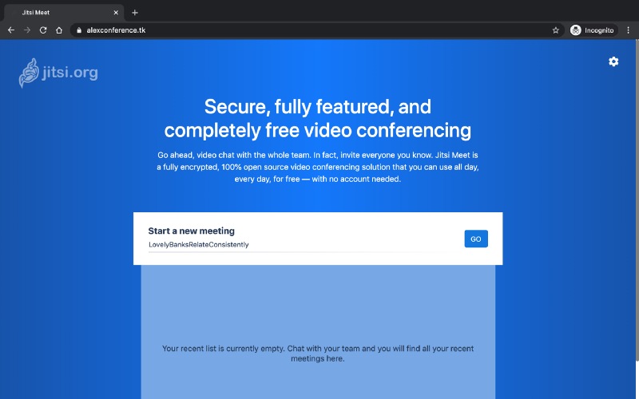

Might be useful for dummies (like me) who want to host video conference for fun/privacy/speed/restrictions/price/other reasons and don’t want to spend a lot of time learning all these things.

### Why

Why to host your “private” video conference app? To influence connection speed (at least, be able to do it by host location, optimizations, control of users count, etc.). To have more confidence in [privacy](https://jitsi.org/security/). To have no “free plan” restrictions. To have fun 😀

Why not to implement it by yourself? Well, actually, why not?! I think that’s a really interesting choice ([plenty](https://github.com/webrtc/samples) [of](https://demo.easyrtc.com/demos/index.html) [examples](https://tsh.io/blog/how-to-write-video-chat-app-using-webrtc-and-nodejs/)). But if you have limited time and need more features than just video call, it makes sense to consider something already implemented.

Why **_Jitsi_** as a video conferencing tool? Open source, many github stars, nice reviews, no big brother (I hope), many features (multiple peers, chat, screen sharing, private chats, authentication, live streaming), etc.

Why **_Digital Ocean_** as a hosting? Easy to set up (understandable UI, many tutorials), close to my country (i.e. probably better speed), reliable (by reviews and self experience), not expensive (60-day free trial, after trial starting from 5$, huge free outbound data transfer).

Why **_Freenom_** as a domain name registrar? Because it provides free domains for 1 year.

P.S. I don’t have really good experience in all these tools. So, this tutorial is just for fast setup and usage that works for a couple of my friends.

---

### Let’s start (3 steps)

#### Step 1. Create Digital Ocean droplet from template image

1.Check that you have an account in [Digital Ocean](https://www.digitalocean.com/). If not — sign up and login. It will give you 100$ trial for 2 months.

2\. Click the following link to start wizard — [**https://cloud.digitalocean.com/droplets/new?image=opentradestatist-jitsiserver-18-04&size=c-2-4gib**](https://cloud.digitalocean.com/droplets/new?image=opentradestatist-jitsiserver-18-04&size=c-2-4gib). ([Image](https://marketplace.digitalocean.com/apps/jitsi-server) that is used in wizard is not mine, so great thanks to the [person](https://github.com/pachamaltese) who developed [it](https://github.com/pachamaltese/jitsi-droplet)).

3\. Select _CPU/RAM + plan_ — depends on how many peers in total you want to support. For example, if you have 9 peers, choose at least **_CPU-Optimized plan 4GB RAM — 2 CPUs_** for no lagging conference.

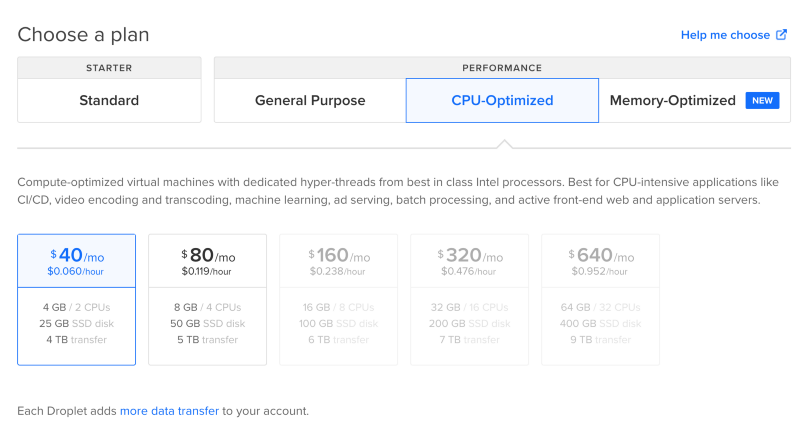

4\. Select _Datacenter region_ — **_closest region_** to your peers location (e.g. Frankfurt for me). **_It’s really important_**, cause entire traffic for 3 and more peers will go to this server and will be transmitted from this server to all peers.

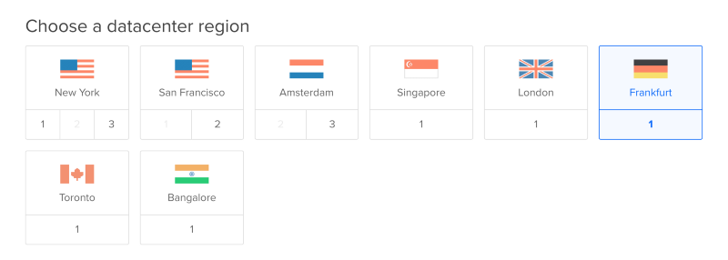

5\. Add _SSH keys_ — add your local ssh key from `~/.ssh/id_rsa.pub` to configure droplet by **_SSH_** in future. (Run `ssh-keygen -t rsa` if you don’t have `id_rsa.pub`)

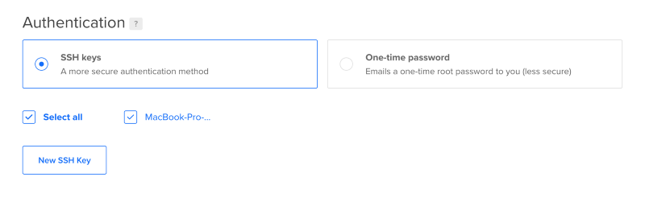

6\. Leave other fields default (if you want).

7\. Click **_Create Droplet_**.

8\. Wait for ~1 minute (you’ll see loading bar) until you see created droplet and **_IP address_** _(_here is mine — _46.101.162.23)_.


9\. You can issue [_http://your-ip_](http://your-ip) (e.g. on [_http://46.101.162.23_)](http://46.101.162.23%29) in the browser to see _nginx welcome page_.

#### Step 2. Create domain

> This step is **required** because **_WebRTC_** (protocol for communication that is used by **Jitsi**) doesn’t work with http IP only. Don’t even try to skip this step!

1.Check that you have an account in any domain name registrar (e.g. [_Freenom_](http://freenom.com/), [_Namecheap_](https://www.namecheap.com/), [_Godaddy_](https://godaddy.com/), etc.). If not — sign up and login. **_Freenom_** is going to be used in further steps.

_Be aware that Freenom free domains will expire after 12 months and might be suspended within this period in_ [_some specific cases_](https://my.freenom.com/knowledgebase.php?action=displayarticle&id=11)_._

2\. If you logged in to Freenom, go to [_https://my.freenom.com/domains.php_](https://my.freenom.com/domains.php) and **_check availability_** of your desired free domain, e.g. _alexconference.tk._

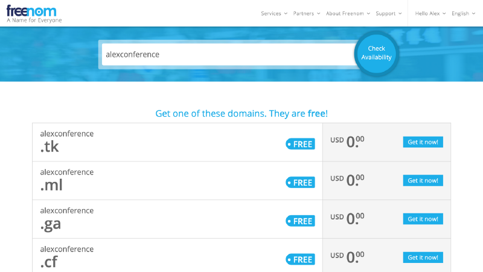

3\. Click **_Get it now!_** and **_Checkout_**.

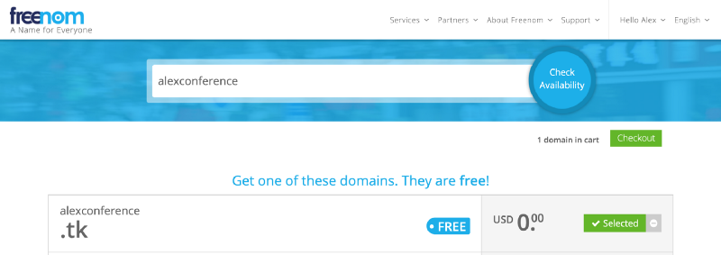

4\. Change **_Period_** from _3 months free_ to _12 months free._

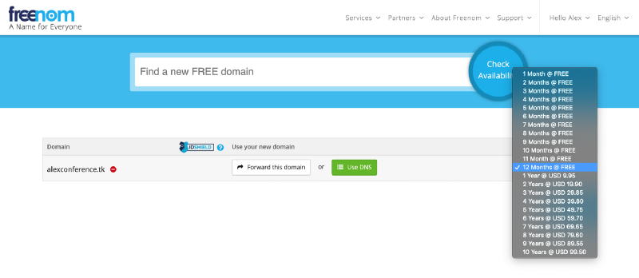

5\. Click **_Use DNS_**, input **_IP address_** twice to _A record_ and click **_Continue_**.

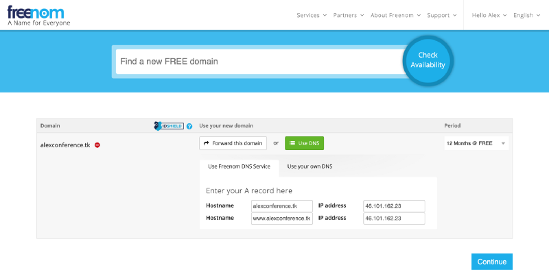

6\. Agree to the _Terms & Conditions_ and click **_Complete Order_**

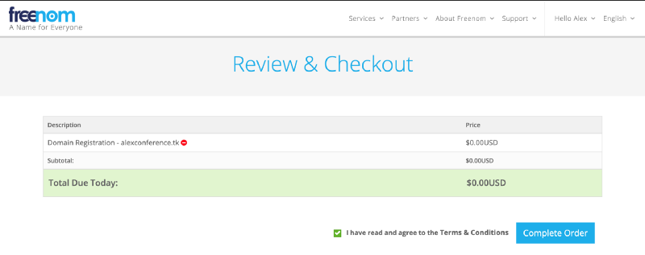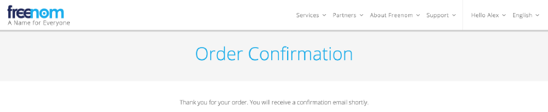

7\. After several minutes issue [http://yourdesireddomain](http://yourdomain) ([http://alexconference.tk](http://alexconference.tk/) in my case) and you’ll see _nginx welcome page_.

> Be worried! It can take even one day! But usually takes ~5 mins.

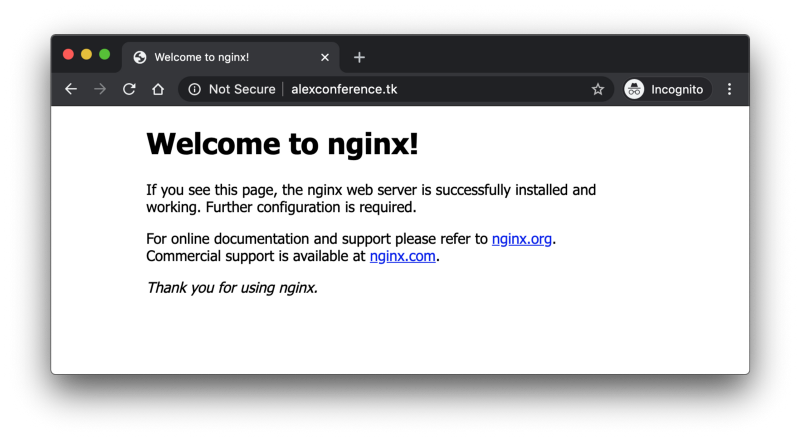

#### Step 3. Install Jitsi

1.  Open terminal and access droplet _console_ with your _IP address_:

```
ssh root@46.101.162.23
```

2\. Check that your domain is ready to use:

```
dig alexconference.tk A +short
```

You’ll see your **_IP_**. If you don’t see your IP wait for a couple of minutes. Usually it takes around 5 mins. But, again, can take an entire day..

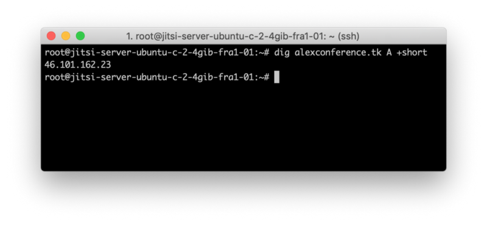

3\. Run script to **_install Jitsi_**. Script is located in `/home/root`, as mentioned [here](https://github.com/pachamaltese/jitsi-droplet/blob/master/scripts/02-conf-scripts.sh). Takes ~1 min.

```
./01_videoconf.sh
```

4\. Input your domain (e.g. _alexconference.tk_) when prompted and click Enter.

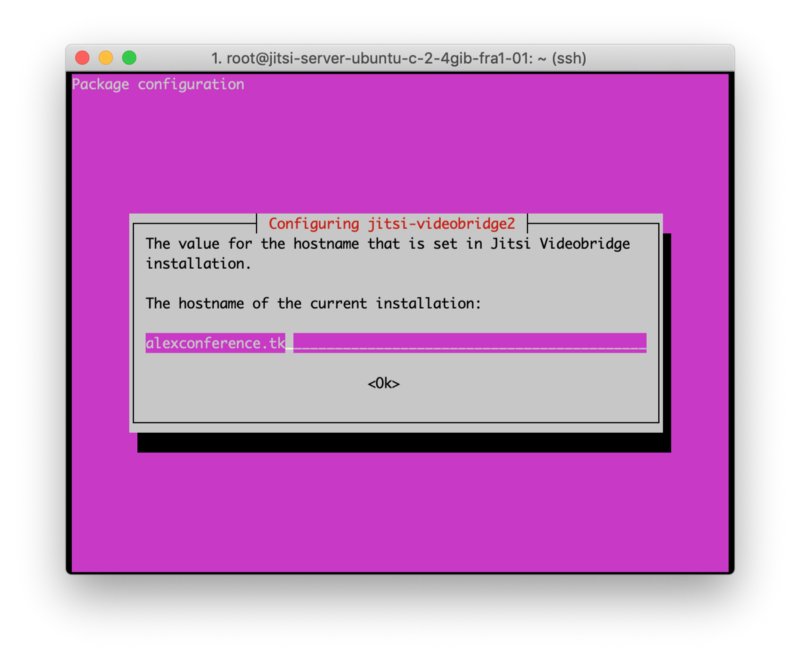

5\. Choose **_Generate a new self-signed certificate_** and click Enter.

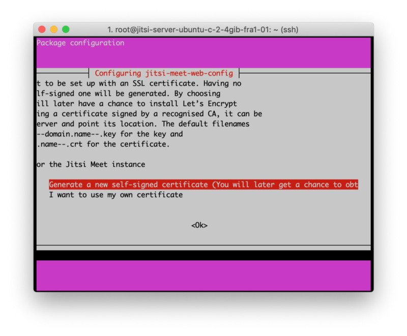

6\. Wait for the script to be finished.

7\. Run script to install **_SSL certificate_** (takes ~1 min).

```
./02_https.sh
```

8\. Enter **_your email_** address.

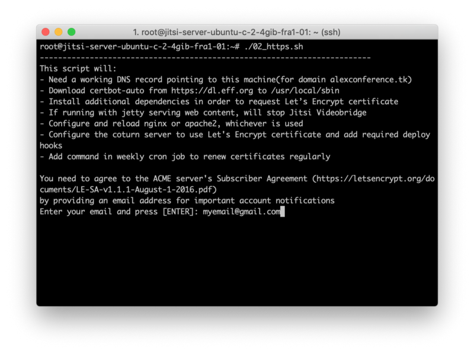

9\. Wait for the script to be finished.

#### THAT’S ALL!

Go to https domain (e.g. [https://alexconference.tk)](https://alexconference.tk%29) and have fun using your self-hosted video-conference.

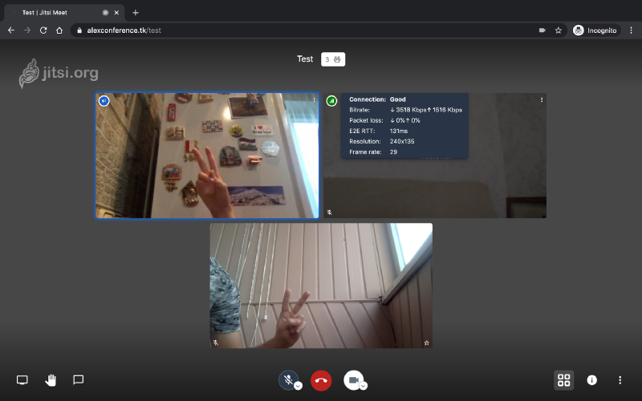

P.S. You can monitor machine load in Digital Ocean _graphs_ section or by monitoring tools (like [_htop_](https://github.com/hishamhm/htop) or [_dockprom_](https://github.com/stefanprodan/dockprom)).

P.S.2. To entirely remove everything simply destroy your droplet from [Digital Ocean](https://cloud.digitalocean.com/droplets) and cancel your domain from [Freenom](https://my.freenom.com/clientarea.php?action=domains).

---

### References

-   **_Jitsi Meet online_** — [https://meet.jit.si/](https://meet.jit.si/)
-   **_Digital Ocean Jitsi server_** — [https://marketplace.digitalocean.com/apps/jitsi-server](https://marketplace.digitalocean.com/apps/jitsi-server)
-   **_Docker Jitsi Docs_** — [https://github.com/jitsi/docker-jitsi-meet](https://github.com/jitsi/docker-jitsi-meet)
-   **_Jitsi bandwidth requirements_** — [https://docs.google.com/spreadsheets/d/1dJfyR2P915DO12C42S7iF1LIn393\_copIX-p7K0ovYo/edit#gid=1170100212](https://docs.google.com/spreadsheets/d/1dJfyR2P915DO12C42S7iF1LIn393_copIX-p7K0ovYo/edit#gid=1170100212)
-   **_Jitsi performance people’s experience_** — [https://community.jitsi.org/t/recommended-server-specs-for-2020](https://community.jitsi.org/t/recommended-server-specs-for-2020)
-   **_Self-hosted Jitsi server with authentication_** — [https://dev.to/noandrea/self-hosted-jitsi-server-with-authentication-ie7](https://dev.to/noandrea/self-hosted-jitsi-server-with-authentication-ie7)
-   **_Video tutorial to host a Jitsi Meet Server_** — [https://www.youtube.com/watch?v=IQRwtUamHQU](https://www.youtube.com/watch?v=IQRwtUamHQU)
-   **_NPM trends in open source video conferencing_** — [https://www.npmtrends.com/janus-vs-kurento-utils-vs-mediasoup-vs-medooze-media-server](https://www.npmtrends.com/janus-vs-kurento-utils-vs-mediasoup-vs-medooze-media-server)
